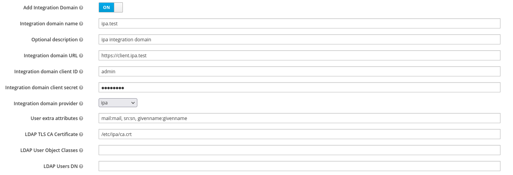

<!---
#
# Copyright (C) 2022  FreeIPA Contributors see COPYING for license
#
-->

# ipa-tuura

This is a bridge providing SCIM 2.0 REST API, that can be deployed on a SSSD client and queries the user identities from the SSSD id provider.

## Installation

### SSSD preparation

Enroll the host as an IPA client:

```bash
ipa-client-install --domain ipa.test --realm IPA.TEST --principal admin --password Secret123 -U
```

The previous step creates a [domain/ipa.test] section in /etc/sssd/sssd.conf
but sssd.conf needs to be customized in order to return additional attributes.

The following script modifies sssd.conf:

```bash
cd $IPA_TUURA/src/install
python prepare_sssd.py
```

### Keycloak integration domain provisioning

Alternatively, auto-enroll the host by providing the required integration domain fields at the SCIM user storage plugin configuration in keycloak.



### Django preparation

Create and activate a python virtual env

```bash
python3 -m venv --system-site-packages ipatuura-env
source ipatuura-env/bin/activate
```

Install the requirements

```bash
pip install -r $IPA_TUURA/src/install/requirements.txt
```

Apply migrations

```bash
cd $IPA_TUURA/src/ipa-tuura
python manage.py migrate
```

Create the djangoadmin user and start the ipa-tuura server

Note: do not use "admin" name as it conflicts with IPA "admin" user

```bash
python manage.py createsuperuser
python manage.py runserver
```

If connecting from another system, update the ALLOWED_HOSTS line `root/settings.py`

```bash
ALLOWED_HOSTS = ['192.168.122.221', 'localhost', '127.0.0.1']
```

as well as the NETLOC from SCIM_SERVICE_PROVIDER settings:

```bash
SCIM_SERVICE_PROVIDER = {
    'NETLOC': 'localhost',
...
```
and replace `localhost` by the IP address or hostname where the service is deployed. This way,
the /ServiceProviderConfig endpoint will return the location of the app implementing the SCIM
api.

Finally, run the following to have django listen on all interfaces:

```bash
python manage.py runserver 0.0.0.0:8000
```

### Documentation

This project uses Sphinx as a documentation generator. Follow these steps to build
the documentation:

```bash
cd $IPA_TUURA/doc/
make venv
make html
```

The generated documentation will be available at `$IPA_TUURA/doc/_build/html/` folder.


### Testing

Provided is a docker-compose.yml container based test environment.  Running this
environment on a system will provide the containers needed for testing some of the
basic features of ipa-tuura:

* ipa-tuura running SCIMv2 Bridge
* Keycloak running with the SCIMv2 User Storage plugin
* FreeIPA to provide IPA service
* LDAP container to provide LDAP service
* DNS container to provide static DNS for the test environment
* Nextcloud to provide End to End application authentication testing


First Install required packages needed to run container test environment:

```bash
sudo dnf -y install podman docker-compose podman-docker \
                    java-17-openjdk-headless maven dnsmasq
```

Start podman service:

```bash
sudo systemctl start podman
```

Clone this repository:

```bash
git clone https://github.com/freeipa/ipa-tuura
cd ipa-tuura
```

Set SELinux boolean:

```bash
sudo setsebool -P container_manage_cgroup true
```

OPTIONAL: Note if you want to setup your local DNS to resolve the container
hostnames, you can follow these steps:

```bash
sudo cp data/configs/nm_enable_dnsmasq.conf /etc/NetworkManager/conf.d/
sudo cp data/configs/nm_zone_test.conf /etc/NetworkManager/dnsmasq.d/
sudo systemctl disable --now systemd-resolved
sudo mv /etc/resolv.conf /etc/resolv.conf.ipa-tuura-backup
sudo systemctl reload NetworkManager
```

Start containers:

```bash
sudo make up
sudo make bridge
```

Note that `make bridge` runs `src/install/setup_bridge.sh` which allows you to
override the keycloak and/or ipa-tuura hostnames if you wish to use this elsewhere.
To do this, just set variables before manually running the script:

```bash
export KC_HOSTNAME=<keycloak server hostname>
export TUURA_HOSTNAME=<ipa-tuura server hostname>
bash src/install/setup_bridge.sh
```

Note that the container names all start with "kite-" which stands for Keycloak
Integration Test Environment.  Each container is named after the service it
provides to make access easier.

Now you can access the containers with either:

```bash
sudo podman exec -it kite-<service> bash
```

Or for some containers, you can access with ssh.  To do so, lookup IP from 
docker-compose.yml file.

```bash
ssh root@<IP>
```

To run Keycloak or IPA commands, you can alias the commands like this:

```bash
alias kcadm='sudo podman exec -it kite-keycloak /opt/keycloak/bin/kcadm.sh'
alias ipa='sudo podman exec -it kite-ipa ipa'
```

