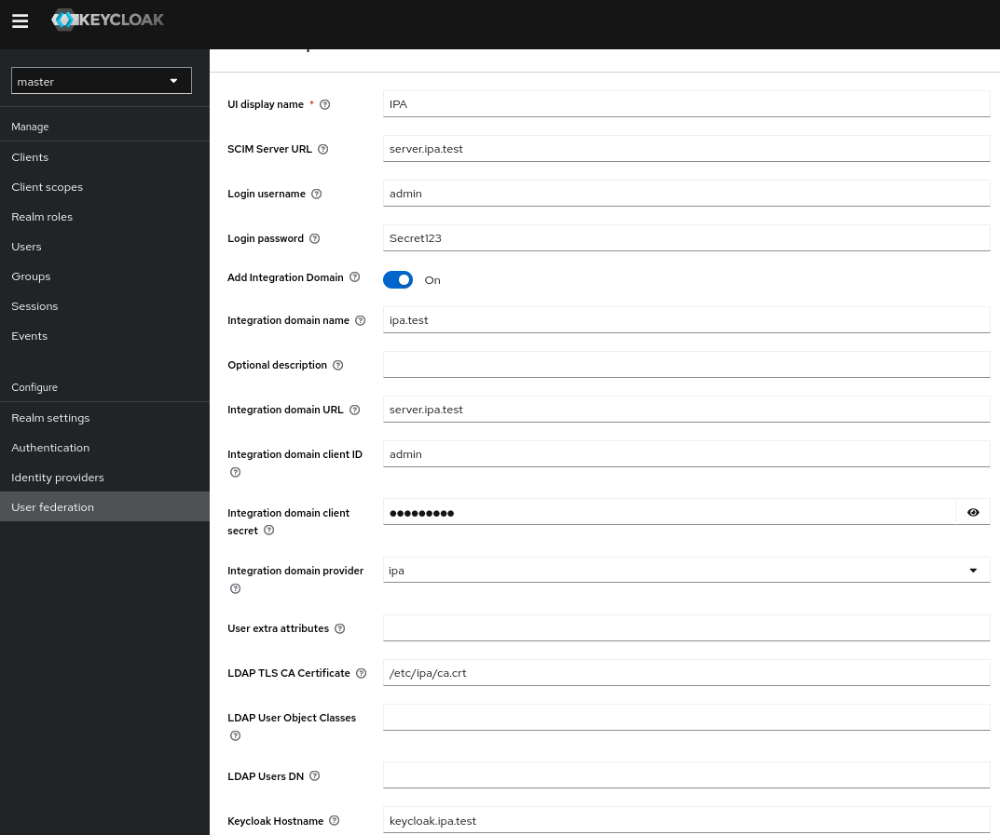

<!---
#
# Copyright (C) 2024  FreeIPA Contributors see COPYING for license
#
-->

# ipa-tuura

[](https://quay.io/repository/freeipa/ipa-tuura)

ipa-tuura is a bridge service that offers multiple Django apps for managing integration domains. Integration domains encompass identity and authentication realms, facilitating Create, Read, Update, and Delete (CRUD) operations for user and group identities, as well as user identity authentication methods. These apps provide REST API endpoints for various purposes:

- **Administrative Endpoint (domains app)**: This app allows you to add and remove integration domains and perform client enrollment of the bridge service in the integration domain. It supports integration with FreeIPA, LDAP and Active Directory.

- **SCIM v2 Endpoint (scim app)**: This app exposes endpoints following the [SCIMv2 specification](https://datatracker.ietf.org/doc/html/rfc7644) and it is based on the [django-scimv2 project](https://github.com/15five/django-scim2) and enables you to read and write user and group identities from/to an integration domain.

- **Authentication Endpoint**: ipa-tuura exposes endpoints for performing both
  GSSAPI-based authentication (`/bridge/login_kerberos`) and password-based
  authentication (`/bridge/login_password`), using
  identities provided provided by the integration domain. These endpoints return
  a session cookie that can be used for further operations that require authentication.

- **Credentials Validation (creds app)**: This app validates the presence and authenticity of specific user credentials from the enrolled integration domain.

## Quick Start

The service is deployed as a systemd container. You can build a container image
based on CentOS Stream by following these commands:

```bash
podman build -t centos-bridge -f Containerfile .
```

Alternatively, you can also build a production-ready RHEL image based on the same source code. Note that you need a [Red Hat Developers](https://developers.redhat.com/) account for building the image, or any other RHEL subscription if you have one:

```bash
subscription-manager register --username <username> --password <password>
podman build -t rhel-bridge --build-arg="BASE_IMAGE=registry.access.redhat.com/ubi9:latest" -f Containerfile .
```

You can also opt for pre-built image from Quay.io: [quay.io/freeipa/ipa-tuura](https://quay.io/repository/freeipa/ipa-tuura)

## Usage

The service can be deployed on a host using the following commands:

```bash
setsebool -P container_manage_cgroup true
podman run --name=bridge -d --privileged --dns <IP address> --add-host <host>:<IP address> -p 8000:8000 -p 3500:3500 -p 81:81 -p 443:443 --hostname <hostname> quay.io/freeipa/ipa-tuura
```
* Where you need to provide host details such as:
- DNS IP address: `--dns <IP address>`
- The integration domain host, so that the bridge service can resolve the name: `--add-host <host>:<IP address>`
- The hostname where the bridge is going to be deployed: `--hostname <hostname>`
- The container image: [quay.io/freeipa/ipa-tuura](https://quay.io/repository/freeipa/ipa-tuura), updated on every release.

To enroll with an existing FreeIPA server, you can use the following CURL command:

```bash
curl -k -X POST "https://bridge.ipa.test/domains/v1/domain/" -H "accept: application/json" -H "Content-Type: application/json" -H "X-CSRFToken: x1yU9RGPKs4mJdWIOzEc7wKbwbnJ0B6iTHuW6ja0gdBpEOBVacK1vIhSSYlfsnRw" -d @freeipa_integration_domain.json"
```
* Where `freeipa_integration_domain.json` is:
~~~
    {
    "name": "ipa.test",
    "description": "IPA Integration Domain",
    "integration_domain_url": "https://master.ipa.test",
    "client_id": "admin",
    "client_secret": "Secret123",
    "id_provider": "ipa",
    "user_extra_attrs": "mail:mail, sn:sn, givenname:givenname",
    "user_object_classes": "",
    "users_dn": "ou=people,dc=ipa,dc=test",
    "ldap_tls_cacert": "/etc/openldap/certs/cacert.pem"
    }
~~~

To un-enroll from an integration domain you can type:

```bash
curl -k -X DELETE "https://bridge.ipa.test/domains/v1/domain/1/" -H "accept: application/json" -H "X-CSRFToken: x1yU9RGPKs4mJdWIOzEc7wKbwbnJ0B6iTHuW6ja0gdBpEOBVacK1vIhSSYlfsnRw"
```

The project also supports 389ds server:

```bash
curl -k -X POST "https://bridge.ipa.test/domains/v1/domain/" -H "accept: application/json" -H "Content-Type: application/json" -H "X-CSRFToken: x1yU9RGPKs4mJdWIOzEc7wKbwbnJ0B6iTHuW6ja0gdBpEOBVacK1vIhSSYlfsnRw" -d @rhds_integration_domain.json"
```
* Where `rhds_integration_domain.json` is:
~~~
    {
    "name": "ldap.test",
    "description": "LDAP Integration Domain",
    "integration_domain_url": "ldap://rhds.ldap.test",
    "client_id": "admin",
    "client_secret": "cn=Directory Manager",
    "id_provider": "ldap",
    "user_extra_attrs": "mail:mail, sn:sn, givenname:givenname",
    "user_object_classes": "",
    "users_dn": "ou=people,dc=ldap,dc=test",
    "ldap_tls_cacert": "/etc/openldap/certs/cacert.pem"
    }
~~~

and Active Directory:

```bash
curl -k -X POST "https://bridge.ipa.test/domains/v1/domain/" -H "accept: application/json" -H "Content-Type: application/json" -H "X-CSRFToken: x1yU9RGPKs4mJdWIOzEc7wKbwbnJ0B6iTHuW6ja0gdBpEOBVacK1vIhSSYlfsnRw" -d @ad_integration_domain.json"
```
* Where `ad_integration_domain.json` is:
~~~
    {
    "name": "da.test",
    "description": "AD Integration Domain",
    "integration_domain_url": "ldap://ad.da.test",
    "client_id": "administrator@da.test",
    "client_secret": "Secret123",
    "id_provider": "ad",
    "user_extra_attrs": "mail:mail, sn:sn, givenname:givenname",
    "user_object_classes": "",
    "users_dn": "cn=Users,dc=da,dc=test",
    "ldap_tls_cacert": "/etc/openldap/certs/cacert.pem"
    }
~~~

Once the bridge service is enrolled to an integration domain, you can start using SCIMv2 app. Frist you need to get a cookie with simple authentication:

```bash
curl -k -s -X POST --data 'username=scim&password=Secret123' -c /tmp/my.cookie -b csrftoken=XzLJ9NmZTQNQcXS6v3JCNUTnV6gFVorJ -H Accept:text/html -H Content-Type:application/x-www-form-urlencoded -H 'X-CSRFToken: XzLJ9NmZTQNQcXS6v3JCNUTnV6gFVorJ' -H referer:https://bridge.ipa.test:443/admin/login/ https://bridge.ipa.test/admin/login/
```
* Where:
~~~
`bridge.ipa.test` is the host that is running the bridge service.
~~~

and this is how you can add a user using a CURL command:

```bash
curl -k --header 'Authorization: Basic ' -b /tmp/my.cookie -s --request POST --data @ipauser.json --header 'Content-Type: application/scim+json' https://bridge.ipa.test/scim/v2/Users
```
* Where `@ipauser.json` is:
~~~
 {
    "schemas": ["urn:ietf:params:scim:schemas:core:2.0:User"],
    "userName": "ftrivino",
    "name":
    {
        "givenName": "Francisco",
        "middleName": "Garcia",
        "familyName": "Trivino"
    },
    "emails":
    [{
        "primary": true,
        "value": "ftrivino@ipa.test",
        "type": "work"
    }],
    "displayName": "ftrivino",
    "externalId": "extId",
    "meta":
    {
        "resourceType":"User"
    }
    "groups": [],
    "active": true
    }
~~~

## Real Use Case
One significant use case for this project is to replace Keycloak User Federation Storage. You can set up your own Keycloak instance and install the following plugin:

[SCIM Keycloak User Storage SPI](https://github.com/justin-stephenson/scim-keycloak-user-storage-spi/)

Once you deploy your Keycloak instance and install the plugin, you can navigate to the User Federation Storage tab and enroll in an integration domain by providing the required integration domain fields at the SCIM user storage plugin configuration in keycloak.



As an example, we can authenticate in Nextcloud by using Keycloak through the
[OpenID Connect user backend](https://apps.nextcloud.com/apps/user_oidc), as
documented
[here](https://www.schiessle.org/articles/2023/07/04/nextcloud-and-openid-connect/).
Assuming there is an integration domain already added to Keycloak using
ipa-tuura, we will be able to seamlessly authenticate using users from our
provider. Additionally, GSSAPI authentication can be performed in case you have
a valid Kerberos ticket available and your browser correctly configured:

* Mozilla Firefox: add the realm to `network.negotiate-auth.trusted-uris` in
`about:config`.
* Google Chrome: run with `--auth-server-whitelist="<keycloak hostname>"` parameter.


## Existing limitations
* The bridge can currently only handle user identities.
* Only one integration domain is allowed per container. The domains app implements a singleton class allowing only one active integration domain. However, you can delete the existing one and enroll to a different system.
* The bridge service is deployed as a privileged container; however, it is recommended to deploy it as non-privileged to follow best practices for container service deployment. This is because SSSD service is not currently rootless.

## Developer documentation

### Django preparation

Create and activate a python virtual env

```bash
python3 -m venv --system-site-packages ipatuura-env
source ipatuura-env/bin/activate
```

Install the requirements

```bash
pip install -r src/install/requirements.txt
```

Apply migrations

```bash
cd src/ipa-tuura
python manage.py migrate
```

Create the `djangoadmin` user and start the ipa-tuura server

Note: do not use "admin" name as it conflicts with IPA "admin" user

```bash
python manage.py createsuperuser
python manage.py runserver
```

If connecting from another system, update the ALLOWED_HOSTS line `root/settings.py`

```bash
ALLOWED_HOSTS = ['192.168.122.221', 'localhost', '127.0.0.1']
```

as well as the `NETLOC` from `SCIM_SERVICE_PROVIDER` settings:

```bash
SCIM_SERVICE_PROVIDER = {
    'NETLOC': 'localhost',
...
```
and replace `localhost` by the IP address or hostname where the service is deployed. This way,
the /ServiceProviderConfig endpoint will return the location of the app implementing the SCIM
api.

Finally, run the following to have django listen on all interfaces:

```bash
python manage.py runserver 0.0.0.0:8000
```
This command will start a lightweight development web server on the local machine.

## Documentation

This project uses Sphinx as a documentation generator. Follow these steps to build
the documentation:

```bash
cd docs/
make venv
make html
```

The generated documentation will be available at `docs/_build/html/` folder.
